# GSOC'21 @ TARDIS : Improving TARDIS Simulation Logging Framework

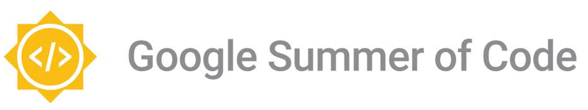

As all good things always come to an end, ***Google Summer of Code 2021*** is no such exception. Learning & Working with Open Source Organisations is an awesome endeavour that is recommended to one & all. I consider myself lucky to have been selected in ***TARDIS*** for my GSOC project on **Improving TARDIS Simulation Logging Framework**. I hereby report  my work in this Repository.


## About TARDIS
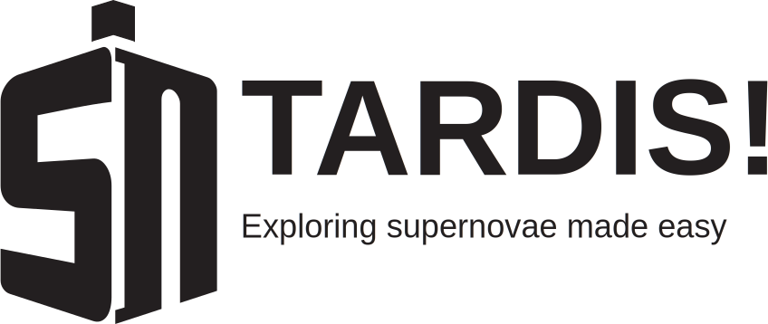

[**TARDIS**](https://tardis-sn.github.io/tardis/index.html) *{ **T**emperature **A**nd **R**adiative **D**iffusion **I**n **S**upernovae }* is an Open Source Astophysics Organisation that participated under GSOC'21. It provides Python packages for astronomy research for analysing supernovae. It uses the Monte Carlo Radiative-Transfer spectral synthesis code for 1D models for supernova ejecta. *TARDIS* can accurately model the supernova ejecta and allows for the analysis along with tools for Visual Representation of the data by providing custom Widgets for plots of different parameters. It makes the analysis very user friendly & easy to comprehend. 

Logging & Tracking are an important part of this project as visualization tools require analysis of particle properties which are stored via this functionality. Logs are present whenever we run ***TARDIS*** simulations allowing for easy logging of the simulation status and validation of the results thus generated. For analysing packet properties, Tracking can be configured.

## About the Project 
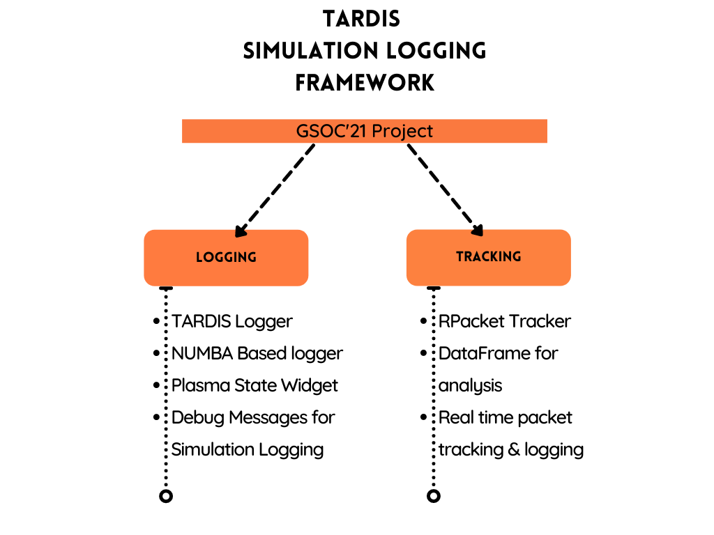

This summer, I was associated with ***TARDIS*** in **Improving TARDIS Simulation Logging Framework**. This project entails setting up and configuring the Simulation Logging such that it enables the logging & debugging of long *TARDIS* simulation runs. The logging system needed to be restructured & implemented keeping in mind that it could be configured by the user. 

Another aspect of my project was to log **NUMBA** *JIT'ted* functions for the input & output parameters. This was not possible as **NUMBA** based functions do not allow traditional Pythonic logging to be implemented due to the way the computation happens.

Tracking was another key part of my project. **RPacket Tracking** was implemented which allows for the tracking of all the interactions a packet may have for all the packets in all the iterations. This feature allows the user to have a [*Dataframe*](https://pandas.pydata.org/docs/reference/api/pandas.DataFrame.html) that stores all these values and hence computation, analysis & visualization can be performed on it.


## Work Product
The deliverables of my project were as follows:

- [x] Improve & Implement a Logging Framework for the Simulations runs in Notebooks as well as terminals [[PR #1633](https://github.com/tardis-sn/tardis/pull/1633)]
- [x] Allow the Logging Framework for the simulation to be configured by functional arguments passed when invoking as well as from YAML config file functional arguments [[PR #1633](https://github.com/tardis-sn/tardis/pull/1633)]
- [x] Adding functionality to detect the environment where *TARDIS* simulation is running [[PR #1650](https://github.com/tardis-sn/tardis/pull/1650)]
- [x] Create a new Ipython Widget that can be used to store & display Plasma Values when logging is turned off [[PR #1640](https://github.com/tardis-sn/tardis/pull/1640)]
- [x] Create a new Logging module under `tardis/io` to keep all the tracking & logging based functionality in a single place [[PR #1684](https://github.com/tardis-sn/tardis/pull/1684)]
- [x] Create a Flow chart which maps the flow of the whole TARDIS architecture when running a Simulation  
- [x] Add logging messages for caught exceptions in Simulation runs [[PR #1701](https://github.com/tardis-sn/tardis/pull/1701)]
- [x] Add debug messages for status of different parameters in logs for Simulation runs [[PR #1704](https://github.com/tardis-sn/tardis/pull/1704)]
- [x] Implement a Tracking Framework for RPackets such that interactions & properties for the packets can be stored & analysed [[PR #1748](https://github.com/tardis-sn/tardis/pull/1748)]
- [x] Storing the interaction properties of the Packets in a DataFrame [[PR #1776](https://github.com/tardis-sn/tardis/pull/1776)]
- [x] Various Tests implemented to for all the functionalities
- [x] Documentation & Tutorials added for the same

### Implementing & Improving Logging Framework
Initially, the existing logging framework was not upto the mark with negilible number of debug messages & did not have the functionality to be configured based on the log level set by the user. 

In my project, I enhanced this functionality by improvising on the information that is presented via the logs, while the simulation is running. Features were added which allows the user to configure the logging framework based on log levels. This can be achived by configuring up the logger to a particular `log_level` or setting up `specific_log_level` to log messages of a particular level.

The current implementation allows configuring the `log_level` & `specific_log_level` parameters from the functional arguments of `run_tardis` such as :
```python
run_tardis(config, log_level="info", specific_log_level=True)
``` 
or via the *TARDIS* config `YAML` as follows: 
```yaml
...
debug:
    log_level : "Debug"
    specific_log_level : True
```
*Reference:*  ***TARDIS*** documentation on [`Configuring the TARDIS Logger`](https://tardis-sn.github.io/tardis/io/optional/logging_configuration.html)

_Enabling Logging functionality via Functional arguments being passed to `run_tardis()` function_
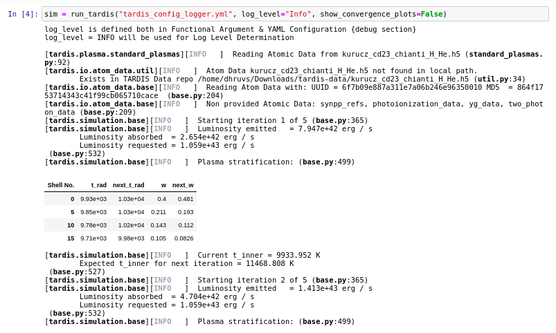<br>
_Configuring the Logging functionality from the `TARDIS YAML` config_
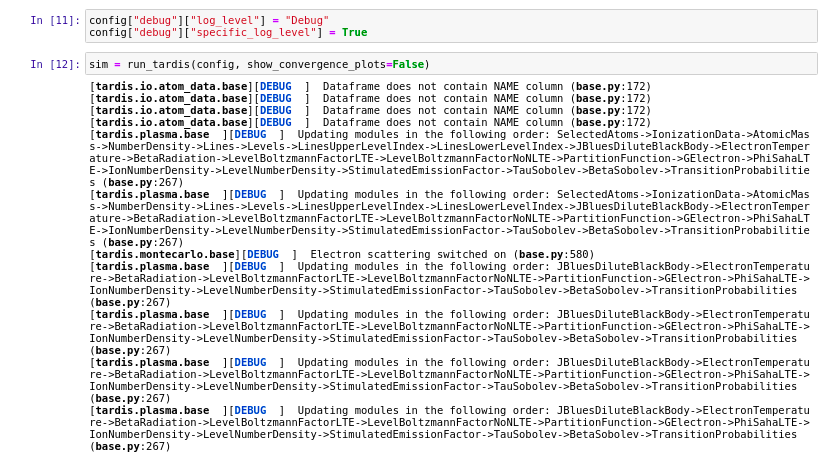

### Adding Functionality to detect run environment of TARDIS simulation
This feature was required for implementing different types of formatting for the log messages such as displaying a *pandas Dataframe* inside the *Jupyter & Jupyter based environment* for better presentation & displaying a printed table when run outside the *IPython kernel or terminals*. This allows *TARDIS* to have different logging output formatting for differnt environments as can be seen below:

_Sample Simulation run inside Jupyter Environment_
<br>
_Same Simulation run inside a Terminal (non Jupyter based Env)_
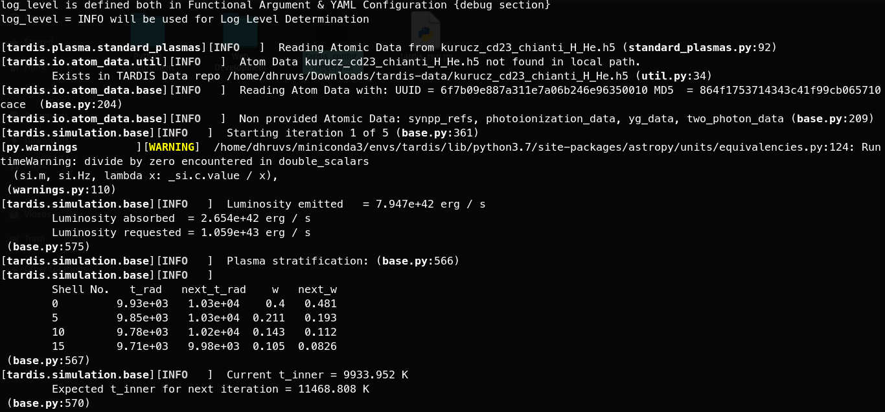<br>

### Flow chart for TARDIS Simulation
A *Flow Chart* mapping the flow of data, setting up of the simulation and its running from start to finish including inputs being read from the *TARDIS* Configuartion YAML was created. The Flow chart can be seen below:

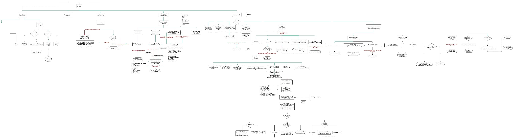<br>
_Please refer to this [link](https://drive.google.com/file/d/1Qq44tx6X5fIk9mrtfeQSrj1agOWSkQKM/view?usp=sharing), if you wish to checkout more about this flowchart_

### Plasma State Widget
`Plasma State Widget` is in development. This feature allows for analysis of the Radiative Temperature `t_rad` and Dilution Factor `w` for each iteration of the *TARDIS* simulation. This provides access to these values when the simulation logging is turned off. A snippet of the same can be seen below:

_Output of the Plasma State Widget once the Simulation run has been completed with logging turned off_
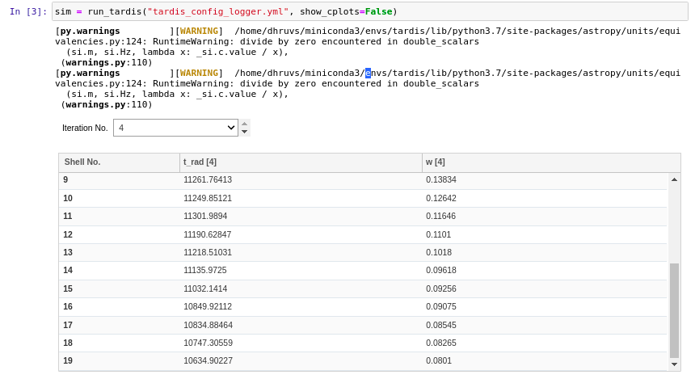

### Adding Debug messages for Caught Exceptions
Caught exceptions are those exceptions that are handled via Exceptions handling, i.e. in simpler terms `try ... except` exceptions. These exceptions were not logged & thus the status for was not available. Adding Debug Log messages to track these changes, provide functionality to debug the states of the simulation.

_check these Debug Messages for the `NAME` attribute_
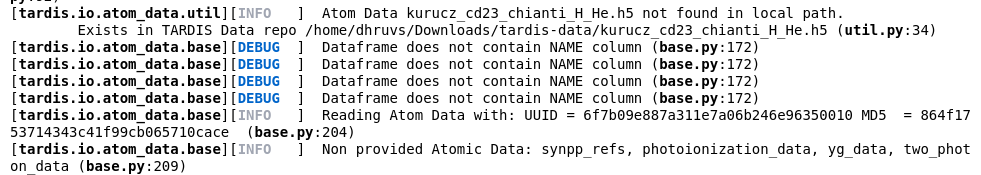

### Adding More Debug Messages to the Simulation
Many debug message were added to *TARDIS* simulation logger. These messages now impart meaningful information in the Simulation & can be analysed or debugged when a Simulation has completed for a set of input parameters passed via the `YAML Config`.

_Sample Debug Messages that have been added to TARDIS_
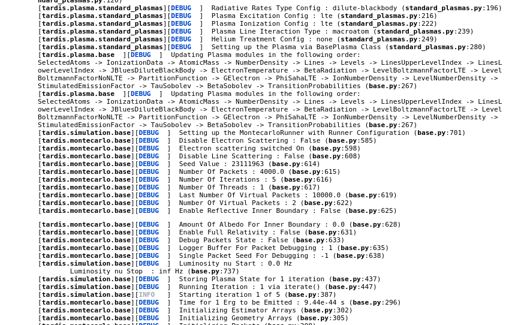
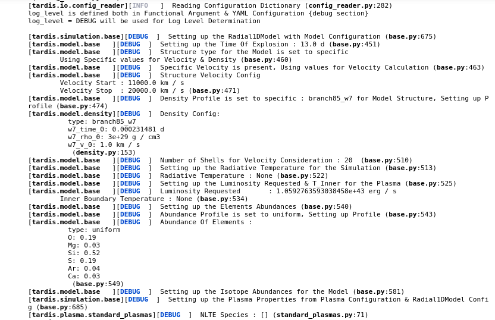

### Tracking RPacket Interactions 
This feature is an important highlight of my proposed ideas for this project. *Tracking RPacket interactions* is a tedious task as it needs to be configured in such a way that it works with **NUMBA**. **NUMBA** does not have the support for native Pythonic logging, though we can use the `with objmode` context manager for logging with the downsight of performance loss. So, as and when this feature is enabled, the simulation run time increases. Thus, this packet tracker can be configured via the YAML config.<br>
The packet Tracker (know as `rpacket_tracker` ;)) allows to track & store all the interactions a packet may have for all the packets that are generated when the simulation is run for each iteration. A `DataFrame` is created to store all these values, allowing easy analysis on the data with `pandas`.

The DataFrame that is generated can be seen as follows:
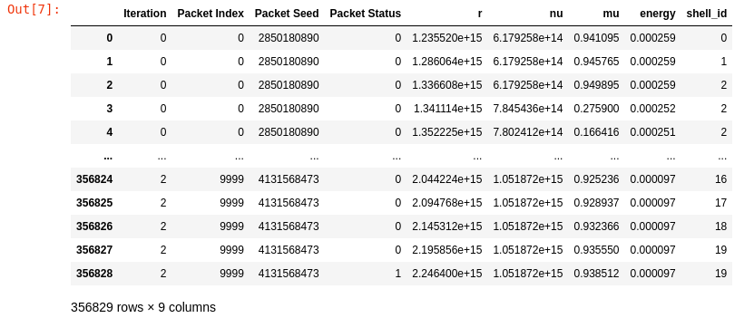

*Reference:* ***TARDIS*** Documentation for `Tracking RPacket Interaction`. 

### Tests & Documentation
Before my coding period commenced, I contributed to improve the Documentation for *TARDIS*. [***Issac Smith***](https://github.com/smithis7) has improved the documentation many folds with enhancements in various areas for explaining difficult physics concepts in simple and elegant way.<br>
Tests as well as Documentation (Tutorials) were added to *TARDIS* for each of the aforementioned feature. Test driven development was a key while planning the different features as *TARDIS* needs to be precise & well tested for all the analysis such that the results are accurate.

## Contributions
The following table shows some of the highlights of the contributions that I have done in GSOC'21 with TARDIS:
| PR Title                                            | PR Number                                             | Status                                            |
| --------------------------------------------------- | ----------------------------------------------------- | ------------------------------------------------- |
| Formatting Logging Output                           | [1632](https://github.com/tardis-sn/tardis/pull/1632) |         |
| Implementing Logging Framework                      | [1633](https://github.com/tardis-sn/tardis/pull/1633) |         |
| Adding Plasma State Widget                          | [1640](https://github.com/tardis-sn/tardis/pull/1640) |           |
| Functionality to detect Run Environment             | [1650](https://github.com/tardis-sn/tardis/pull/1650) |         |
| Restructured Logging framework to `tardis/io`       | [1684](https://github.com/tardis-sn/tardis/pull/1684) |         |
| Added logging support for caught exceptions         | [1701](https://github.com/tardis-sn/tardis/pull/1701) |         |
| Added Debug Messages to Simulation Logs             | [1704](https://github.com/tardis-sn/tardis/pull/1704) |  |
| Changed Formatting based on log level               | [1710](https://github.com/tardis-sn/tardis/pull/1710) |           |
| Renamed `montecarlo_logger` to `montecarlo_tracker` | [1740](https://github.com/tardis-sn/tardis/pull/1740) |         |
| Tracking RPacket Properties in `single_packet_loop` | [1748](https://github.com/tardis-sn/tardis/pull/1748) |  |
| Adding DataFrame for RPacket Tracking               | [1776](https://github.com/tardis-sn/tardis/pull/1776) |  |

I have also made serveral PRs to bug fix some of the bugs that were encountered in the project. Tests & Documentation were a part of some of the aforementioned PRs.

These are some of the issues I have created, [here](https://github.com/issues?q=is%3Aopen+is%3Aissue+author%3ADhruvSondhi+archived%3Afalse+org%3Atardis-sn).

There are some of my contributions to the [`TARDIS Website`](https://github.com/tardis-sn/tardis-sn.github.io/) & the [`Documentation`](https://tardis-sn.github.io/tardis/index.html) of *TARDIS* before the GSOC Coding period commenced. These contributions can be seen [here](https://github.com/tardis-sn/tardis-sn.github.io/pulls?q=is%3Apr+author%3A%40me+) ([Website](https://github.com/tardis-sn/tardis-sn.github.io/)) as well as [here](https://github.com/pulls?q=author%3ADhruvSondhi+archived%3Afalse+org%3Atardis-sn+created%3A%3C2021-06-07) ([Documentation](https://tardis-sn.github.io/tardis/index.html))

All my contributions can be seen on this [link](https://github.com/pulls?q=author%3ADhruvSondhi+archived%3Afalse+org%3Atardis-sn).

## Future Scope
I propose to contribute to the following ideas which would continue after GSOC'21s:

- **NUMBA Logger** : Implementation of a Logging framework for logging the Input & Output of the *JIT'ted* functions. Additional functionality include logging the list of arguments being passed into the function, time taken to run the function, etc.
- **Real Time Logging** : This functionality, when implemented, would allow for tracking & analysing packet properties after the simulation has run. It could allow to infer packet properties based on time frame selected in an iteration.
- **Allow `single_packet_loop` to be accessible without setting up the Simulation** : This functionality will allow a single packet to be passed directly inside the `single_packet_loop` for analysis of the interactions and its properties. 


## Conclusion
My project was linked to the internal functioning of **TARDIS** codebase, with the guidance from my awesome mentors, I was able to overcome all obstacles & implemented a variety of features in the given time frame.

I got hands on experience working on many new techniques that are used within the codebase, learnt a lot of new things related to python, astronomy, etc.

I worked directly with researchers from the astronomy field which is a dream come true. My project still has many new features that are in development but most of them would be implemented in the near future as I will continue contributing to *TARDIS*. 

This is an experience that will be a milestone & I thank all those who have helped me reach here, my mentors, parents, Google, fellow GSOCers(who guided me through the process). 

With combined efforts, there is no stopping in making *TARDIS* the best possible astronomy packages ;).

## Acknowledgement 
I extend my heartiest thanks to [**Andrew Fullard**](https://github.com/andrewfullard), [**Jack O'Brien**](https://github.com/Rodot-) & [**Wolfgang Kerzendorf**](https://github.com/wkerzendorf) for all the guidance & support they have provided me in this journey. They have led the way in learning new techniques in Python as well as helped me understand the complex internal working of *TARDIS*. They have assisted in structuring the code for contributing to this codebase. They have always directed me in the right direction to conquer all the problems that came our way in the development & implementation of these features. 

Specially thanks to **Andrew** & **Wolfgang** for encouraging me & supporting me from the start (before the selection for *GSOC*) and helping me learn & grow. Thank you very much for your invaluable support & guidance.

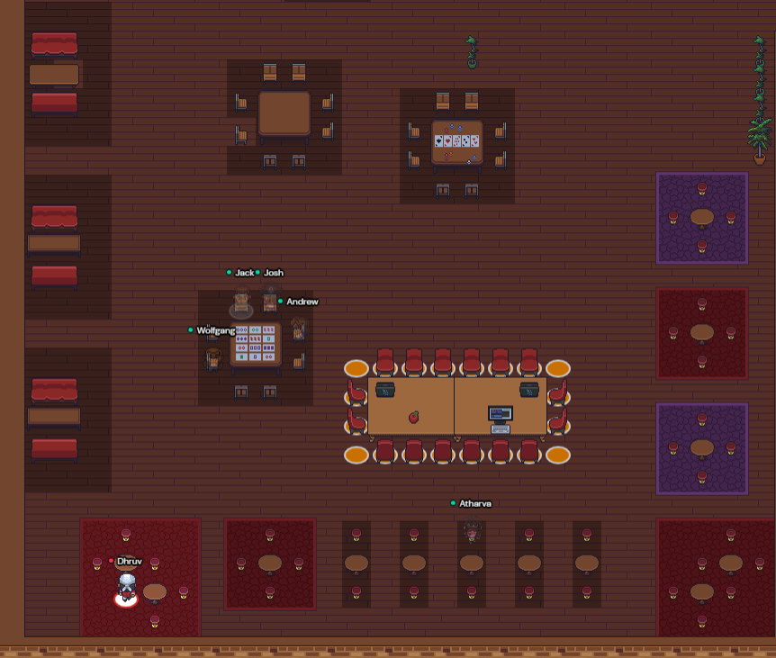

I would also like to thank ***TARDIS Collaboration*** & ***Google*** for giving me the opportunity to work with them this Summer via *GSOC'21* & in the process get acquainted with the research work that is being persued bys ***TARDIS***.
